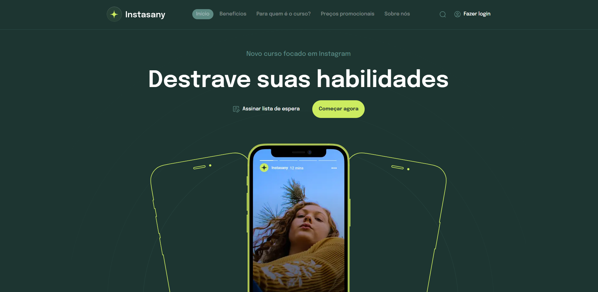

# Instasany

# Índice

- [Descrição do Projeto](#descrição-do-projeto)
- [Status do Projeto](#status-do-Projeto)
- [Funcionalidades e Demonstração da Aplicação](#funcionalidades-e-demonstração-da-aplicação)
- [Acesso ao Projeto](#acesso-ao-projeto)
- [Tecnologias utilizadas](#tecnologias-utilizadas)
- [Licença](#licença)
- [Contato](#contato)
- [Agradecimento](#agradecimento)

# Descrição do projeto

Este projeto é resultado de uma aula disponibilizada via YouTube no canal CodeBoost, com o objetivo de criar uma página sobre criação de conteúdos no Instagram.

# Status do projeto

:construction: Projeto finalizado :construction:

# :hammer: Funcionalidades e Demonstração da Aplicação

- `Funcionalidade 1`: Renderizar os conteúdos relativos ao conteúdo da página;
- `Funcionalidade 2`: Exibir as animações realizadas;

# 📁 Acesso ao projeto

O projeto está disponibilizado no site da Vercel, através do seguinte link: https://instasany-ixu2.vercel.app/

# 🛠️ Abrir e rodar o projeto

1.  Clonar o projeto:
    `git clone https://github.com/jessicaalines/instasany.git`

2.  Instalar dependências de desenvolvimento ( Nota: Verifique o arquivo package.json para validar as versões testadas e suportadas ):
    `npm install`

3.  Execute o servidor de desenvolvimento local:
    `npm run dev`

# Tecnologias utilizadas

`Next.js`
`gsap`
`React`
`react-dom`
`TypeScript`
`Tailwind`

# Licença

Instasany is MIT licensed.

# Contato

- LinkedIn: https://www.linkedin.com/in/jessica-aline-soares-oliveira/
- E-mail: jess.alineoliveira@gmail.com

# Agradecimentos

Ao canal CodeBoost por impulsionar a comunidade Frontend.
